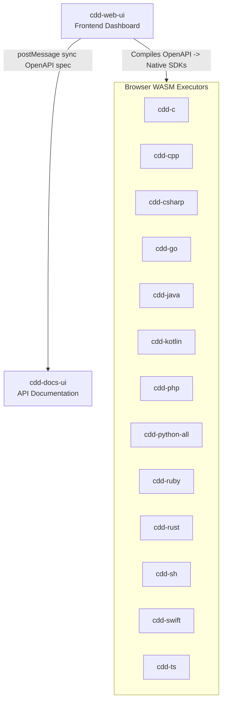
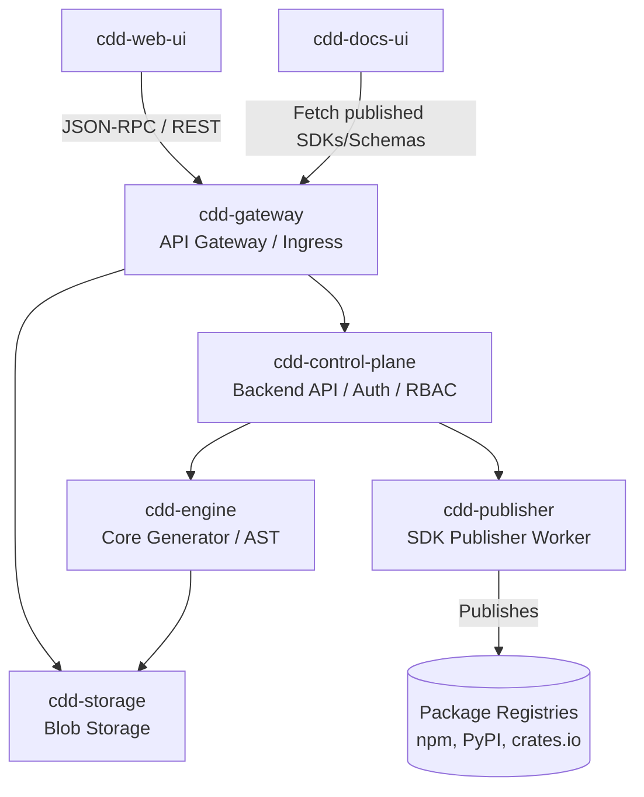

<!-- prettier-ignore -->
cdd-web-ui
==========


[](https://opensource.org/licenses/Apache-2.0)

**CDD Web UI** is the central graphical interface for the Compiler Driven Development (CDD) ecosystem.

Compiler Driven Development is a methodology of rapid application development that focuses on producing _more_ code, not less. Rather than relying on a general-purpose language, DSL, or "generated DO NOT TOUCH" directories, CDD generates idiomatic native code (e.g., Python `class`es, SQL `CREATE TABLE`s, Rust `struct`s) directly into your workspace.

This repository coordinates all known CDD implementations (`cdd-c`, `cdd-rust`, `cdd-ts`, etc.) into a cohesive, offline-first web interface powered by WebAssembly (WASM).

## Features

### Offline-First Architecture

The entire application runs fully offline inside your browser. It utilizes standard browser APIs (`localStorage`) to persist your data locally.

- **Data Model:** Aligns seamlessly with the GitHub API schema (`User` -> `Organization` -> `Repository`) in preparation for future online synchronization and 'Login with GitHub' capabilities.
- **WASM Powered:** Code generation logic is executed natively in the browser via WebAssembly, removing the need for cloud backends or external APIs.
  - **Native WASI Targets:** `cdd-rust`, `cdd-go`, and `cdd-csharp` successfully compile entirely to standalone `wasm32-wasi` and are natively executed inside the browser shim.
  - **C/C++ Emscripten Output:** `cdd-c` and `cdd-cpp` are actively compiled via the `emcmake` toolchain into `JS` wrapping files.
  - **Packaged Virtual Filesystems:** `cdd-ruby` and `cdd-php` pack their entire source-code offline into `wasi-vfs` binaries bundled alongside their pre-compiled interpreters (e.g. VMware Labs PHP or `ruby+stdlib.wasm`).
  - **JVM & Pyodide Mocks:** `cdd-java` and `cdd-kotlin` produce `.jar` files intended to be spun up dynamically via CheerpJ. `cdd-python` produces a `.zip` archive intended to be interpreted using Pyodide's `micropip` infrastructure. `cdd-ts` polyfills deep NodeJS primitives (`node:fs/promises`, `node:crypto`) to run under QuickJS via `javy-cli`.

### Interactive OpenAPI ↔ SDK Editor

- **Bi-directional Editing:** Provide an OpenAPI specification to produce client/server libraries, or edit the generated code and watch it synthesize the OpenAPI spec back.
- **Multi-Language Support:** Toggle code generation for various languages (Python, Rust, TypeScript, etc.). Languages lacking WASM support will display a disabled state.
- **Split-View Pane:** Side-by-side editing interface powered by standard text areas, styled dynamically with Angular Material.

### Technical Stack

- **Framework:** Angular v19+ (Standalone Components, Signals)
- **UI Toolkit:** Angular Material v19+ (`@angular/material`)
- **i18n:** Built-in multilinguality using `@angular/localize`
- **Testing:**
  - Unit tests running on Vitest (100% coverage).
  - End-to-End workflows validated using Playwright (`e2e/`).

## Architecture

### 1. Web Client & Local Execution

The CDD UI can execute code generation entirely offline within the browser via WASM.



### 2. Control Plane & Backend

The UI also interfaces with a backend Control Plane for API routing, cloud generation, and SDK publishing.



## Getting Started

### Local Development

1. **Install dependencies:**

   ```bash
   npm install
   ```

2. **Run the development server:**

   ```bash
   npm start
   ```

   Navigate to `http://localhost:4200/`.

3. **Run tests:**
   ```bash
   npm test
   npx playwright test
   ```

### Execution Modes

The CDD Web UI supports four flexible ways to execute code generation, configurable directly from the **Settings Dialog** (gear icon) in the UI:

1. **Locally (relative paths to wasm)**
   - **How it works:** Loads the compiled WASM binaries directly from your local assets folder (`/assets/wasm/`).
   - **Setup:** Run `npm run build:wasm:local` (requires `cdd-engine` cloned adjacently) or just use the pre-packaged assets if available, then run `npm start`.

2. **Locally (cdd-engine wasm)**
   - **How it works:** Offloads generation entirely to a local `cdd-engine` JSON-RPC daemon running WASM under the hood (via `wasmtime`).
   - **Setup:** Run `cargo run --bin cdd-rpc-wasm --release -- --bind 0.0.0.0:8083 --config ./config.json` from the `cdd-engine` repository. In the UI, set your backend URL to `http://localhost:8083` and switch the mode to "Locally (cdd-engine wasm)".

3. **Locally (cdd-engine native runtimes)**
   - **How it works:** Bypasses WASM entirely and executes native tools installed on your host machine (e.g., Python, Rustc) via the `cdd-engine` daemon.
   - **Setup:** Run `cargo run --bin cdd-rpc --release -- --bind 0.0.0.0:8082 --config ./config.json` from the `cdd-engine` repository. In the UI, set your backend URL to `http://localhost:8082` and switch the mode to "Locally (cdd-engine native runtimes)".

4. **Served (GitHub Releases)**
   - **How it works:** Dynamically fetches the latest pre-compiled WASM binary directly from each respective language's GitHub releases page (e.g. `cdd-python-all`, `cdd-rust`) executing them entirely in your browser.
   - **Setup:** Select "Served (GitHub releases)" from the settings dialog. No local backend or binaries are required.

### Docker Deployment

The application can be compiled into a static artifact and served via an ultra-lightweight Nginx container.

We provide a specialized `make` workflow to clone all requisite `cdd-*` compiler repositories, build the web UI, and package it.

```bash
# Build the Alpine and Debian based images
make build_docker

# Test the resulting containers locally
make test_docker
```

This pipeline automatically extracts the static build output into `build-from-alpine` and `build-from-debian` directories for immediate local hosting or CI/CD artifact storage.

---

## The CDD Ecosystem

This Web UI sits on top of a larger suite of bidirectional compilers:

| Repository                                                     | Language                        | Client; Client CLI; Server | Extra features                                            | Standards                                     | CI Status                                                                                                                                                   | WASM Notes                                              |
| -------------------------------------------------------------- | ------------------------------- | -------------------------- | --------------------------------------------------------- | --------------------------------------------- | ----------------------------------------------------------------------------------------------------------------------------------------------------------- | ------------------------------------------------------- |
| [`cdd-c`](https://github.com/SamuelMarks/cdd-c)                | C (C89)                         | Client; Client CLI; Server | FFI                                                       | Swagger 2.0 & OpenAPI 3.2.0                   | [](https://github.com/SamuelMarks/cdd-c/actions/workflows/ci.yml)             | 0.80MB - Executes via pure WASI                         |
| [`cdd-cpp`](https://github.com/SamuelMarks/cdd-cpp)            | C++                             | Client; Client CLI; Server | Upgrades Swagger & Google Discovery to OpenAPI 3.2.0      | Google Discovery; Swagger 2.0 & OpenAPI 3.2.0 | [](https://github.com/SamuelMarks/cdd-cpp/actions/workflows/ci.yml)         | 4.40MB - Executes via pure WASI                         |
| [`cdd-csharp`](https://github.com/SamuelMarks/cdd-csharp)      | C#                              | Client; Client CLI; Server | CLR                                                       | Swagger 2.0 & OpenAPI 3.2.0                   | [](https://github.com/SamuelMarks/cdd-csharp/actions/workflows/ci.yml)   | 5.44MB - Executes via pure WASI (Wasi.Sdk)              |
| [`cdd-go`](https://github.com/SamuelMarks/cdd-go)              | Go                              | Client; Client CLI; Server |                                                           | Swagger 2.0 & OpenAPI 3.2.0                   | [](https://github.com/SamuelMarks/cdd-go/actions/workflows/ci.yml)           | 14.14MB - Executes via pure WASI                        |
| [`cdd-java`](https://github.com/SamuelMarks/cdd-java)          | Java                            | Client; Client CLI; Server |                                                           | Swagger 2.0 & OpenAPI 3.2.0                   | [](https://github.com/SamuelMarks/cdd-java/actions/workflows/ci.yml)       | 21.39MB - Executes via pure WASI (GraalVM native-image) |
| [`cdd-kotlin`](https://github.com/offscale/cdd-kotlin)         | Kotlin (ktor for Multiplatform) | Client; Client CLI; Server | Auto-Admin UI                                             | Swagger 2.0 & OpenAPI 3.2.0                   | [](https://github.com/offscale/cdd-kotlin/actions/workflows/ci.yml)         | 0.45MB - Executes via pure WASI                         |
| [`cdd-php`](https://github.com/SamuelMarks/cdd-php)            | PHP                             | Client; Client CLI; Server |                                                           | Swagger 2.0 & OpenAPI 3.2.0                   | [](https://github.com/SamuelMarks/cdd-php/actions/workflows/ci.yml)         | 24.79MB - Executes via pure WASI                        |
| [`cdd-python-all`](https://github.com/offscale/cdd-python-all) | Python                          | Client; Client CLI; Server |                                                           | Swagger 2.0 & OpenAPI 3.2.0                   | [](https://github.com/offscale/cdd-python-all/actions/workflows/ci.yml) | 48.11MB - Executes via WASI (py2wasm)                   |
| [`cdd-ruby`](https://github.com/SamuelMarks/cdd-ruby)          | Ruby                            | Client; Client CLI; Server |                                                           | Swagger 2.0 & OpenAPI 3.2.0                   | [](https://github.com/SamuelMarks/cdd-ruby/actions/workflows/ci.yml)       | 51.21MB - Executes via WASI (rbwasm)                    |
| [`cdd-rust`](https://github.com/offscale/cdd-rust)             | Rust                            | Client; Client CLI; Server |                                                           | Swagger 2.0 & OpenAPI 3.2.0                   | [](https://github.com/offscale/cdd-rust/actions/workflows/ci.yml)             | 4.72MB - Executes via pure WASI                         |
| [`cdd-sh`](https://github.com/SamuelMarks/cdd-sh)              | Shell (/bin/sh)                 | Client; Client CLI; Server |                                                           | Swagger 2.0 & OpenAPI 3.2.0                   | [](https://github.com/SamuelMarks/cdd-sh/actions/workflows/ci.yml)           | 10.48MB - Executes via pure WASI                        |
| [`cdd-swift`](https://github.com/SamuelMarks/cdd-swift)        | Swift                           | Client; Client CLI; Server |                                                           | Swagger 2.0 & OpenAPI 3.2.0                   | [](https://github.com/SamuelMarks/cdd-swift/actions/workflows/ci.yml)     | 94.83MB - Executes via pure WASI                        |
| [`cdd-ts`](https://github.com/offscale/cdd-ts)                 | TypeScript                      | Client; Client CLI; Server | Auto-Admin UI; Angular; React; Vue; fetch; Axios; Node.js | Swagger 2.0 & OpenAPI 3.2.0                   | [](https://github.com/offscale/cdd-ts/actions/workflows/ci.yml) | 14.68MB - Executes via WASI (Node.js polyfilled)        |

_All 13 of the above implementations successfully compile to WebAssembly and run entirely client-side without any backend server (i.e., CDN-only mode)._

## Platform Architecture

The `cdd` ecosystem is powered by a distributed microservice architecture:

| Repository                                                              | Role        | Description                                                                                        | CI Status                                                                                                                                                               |
| ----------------------------------------------------------------------- | ----------- | -------------------------------------------------------------------------------------------------- | ----------------------------------------------------------------------------------------------------------------------------------------------------------------------- |
| [`cdd-web-ui`](https://github.com/SamuelMarks/cdd-web-ui)               | Frontend    | The central control plane dashboard and UI for managing organizations, repositories, and releases. | [](https://github.com/SamuelMarks/cdd-web-ui/actions/workflows/ci.yml)               |
| [`cdd-control-plane`](https://github.com/SamuelMarks/cdd-control-plane) | Backend API | Manages Database, Auth, RBAC, organizations, and secrets.                                          | [](https://github.com/SamuelMarks/cdd-control-plane/actions/workflows/ci.yml) |
| [`cdd-engine`](https://github.com/SamuelMarks/cdd-engine)               | Generator   | Core code generation, WASI orchestration, and AST transformations.                                 | [](https://github.com/SamuelMarks/cdd-engine/actions/workflows/ci.yml)               |
| [`cdd-gateway`](https://github.com/SamuelMarks/cdd-gateway)             | Ingress     | API Gateway, reverse proxy, and routing.                                                           | [](https://github.com/SamuelMarks/cdd-gateway/actions/workflows/ci.yml)             |
| [`cdd-publisher`](https://github.com/SamuelMarks/cdd-publisher)         | Worker      | Background worker for secure SDK releases to package registries.                                   | [](https://github.com/SamuelMarks/cdd-publisher/actions/workflows/ci.yml)         |
| [`cdd-storage`](https://github.com/SamuelMarks/cdd-storage)             | Storage     | High-performance blob storage for JSON schemas and SDK zip artifacts.                              | [](https://github.com/SamuelMarks/cdd-storage/actions/workflows/ci.yml)             |
| [`cdd-docs-ui`](https://github.com/SamuelMarks/cdd-docs-ui)             | Frontend    | Dynamic API documentation viewer rendered for published endpoints.                                 | [](https://github.com/SamuelMarks/cdd-docs-ui/actions/workflows/ci.yml)             |

---

## License

Licensed under either of

- Apache License, Version 2.0 ([LICENSE-APACHE](LICENSE-APACHE) or <https://www.apache.org/licenses/LICENSE-2.0>)
- MIT license ([LICENSE-MIT](LICENSE-MIT) or <https://opensource.org/licenses/MIT>)

at your option.

### Contribution

Unless you explicitly state otherwise, any contribution intentionally submitted
for inclusion in the work by you, as defined in the Apache-2.0 license, shall be
dual licensed as above, without any additional terms or conditions.
